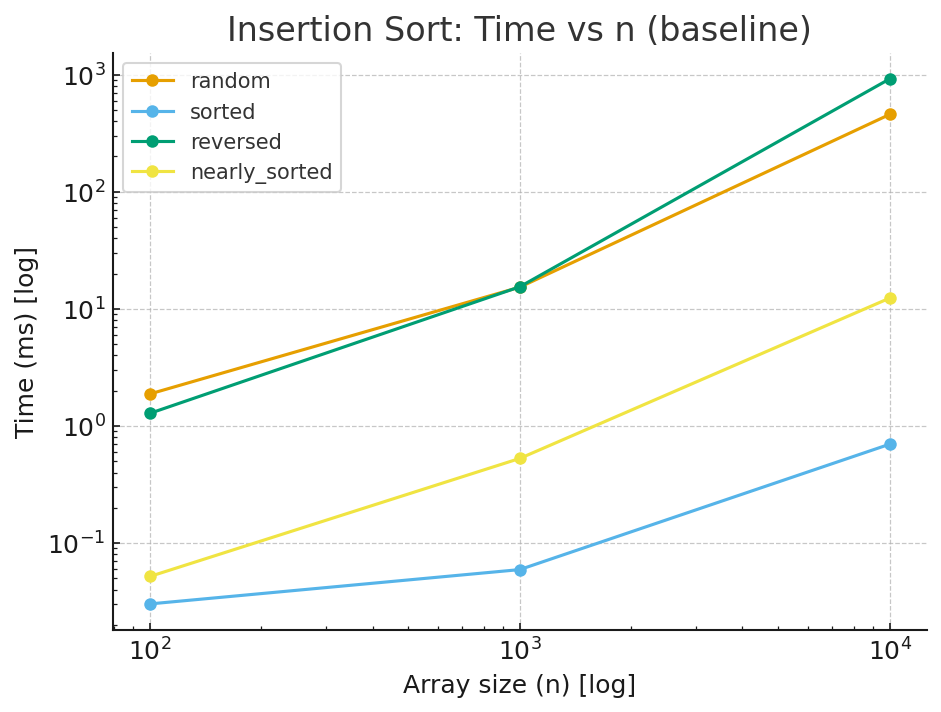
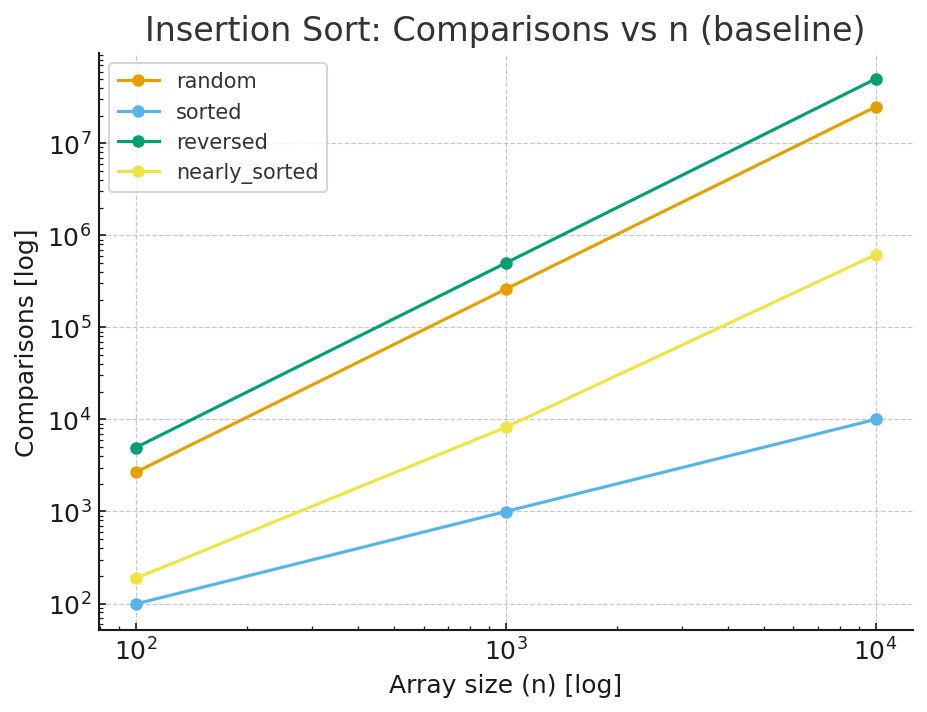
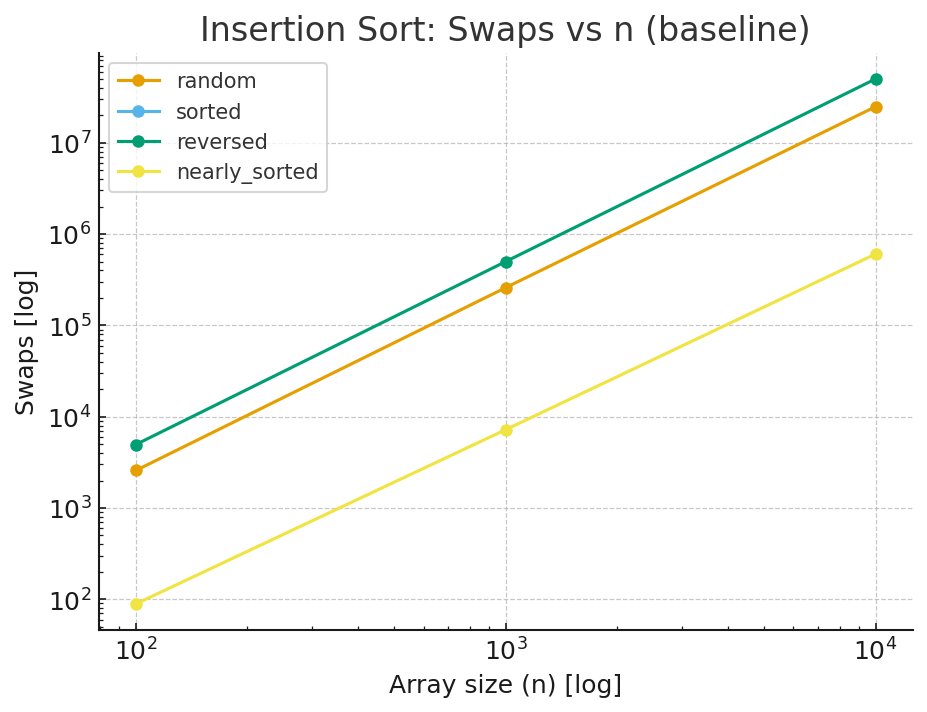
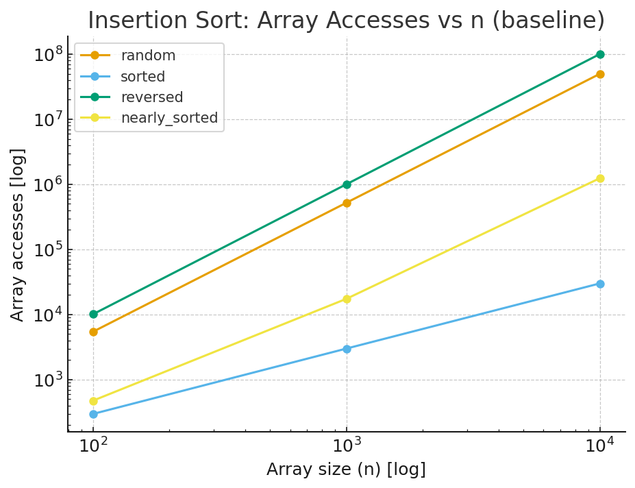

# Analysis Report: Insertion Sort (Partner’s Algorithm)

## 1. Algorithm Overview

Insertion Sort is a simple sorting algorithm. It builds the sorted array one element at a time.  
At each step, the algorithm takes the next element and inserts it into the correct place in the already sorted part of the array.

It works well on nearly sorted arrays and small inputs.

---

## 2. Complexity Analysis

### Time Complexity
- Best Case (already sorted input): n comparisons, no shifts → Omega(n)
- Average Case: about n²/4 comparisons and shifts → Theta(n²)
- Worst Case (reverse-sorted input): about n²/2 comparisons and shifts → O(n²)

### Space Complexity
- Works in-place → O(1) extra space

### Recurrence
Although iterative, the cost can be written as  
T(n) = T(n-1) + O(n) → O(n²)

---

## 3. Code Review

The code in the partner’s repository is a Java implementation of Insertion Sort with additional features such as metric tracking, unit tests, and command line benchmarking.

### Observations
- The implementation is correct and produces the expected results.
- Code style is generally clear, but some variable names are short and not descriptive. Longer names would improve readability.
- The algorithm is implemented in a single loop structure with nested comparisons and shifts. This matches the textbook definition of insertion sort.
- Comments are minimal. Adding more explanation of steps and methods would make the code easier to maintain.
- The project structure follows Maven conventions, with separation into algorithms, metrics, CLI, and tests.

### Performance considerations
- The current version always uses a linear scan to find the insertion point. This is standard but inefficient for large n.
- No sentinel or guard is used, which leads to additional boundary checks.
- Metric collection adds overhead but is acceptable for analysis purposes.

### Suggested improvements
- Use binary search to locate the insertion position. This would reduce the number of comparisons but not the number of shifts.
- Introduce a sentinel element to avoid repeated boundary checks inside the inner loop.
- Add an early exit condition when the array is already sorted.
- Improve code documentation and variable naming.

These improvements would not change the quadratic time complexity but would reduce constant factors and improve maintainability.

---

## 4. Empirical Results

The file `insertion_results.csv` contains benchmark data for different input sizes and input types (random, sorted, reversed, nearly sorted). Both the baseline insertion sort and a binary insertion sort variant were measured.

### Key results
- **Sorted input:** Very fast, time grows almost linearly with n. Few or no swaps are needed. This matches the best case behavior.
- **Reversed input:** Slowest case. Both comparisons and swaps grow close to n². Time results confirm quadratic growth.
- **Random input:** Results fall between best and worst case. The number of comparisons and swaps grows quadratically.
- **Nearly sorted input:** Much faster than random input. Only a small number of shifts are needed. Performance is close to the best case.

### Graphs
Based on the CSV, the following trends are visible:
- Time vs n: Log-log plots show a straight line with slope close to 2 for random and reversed input, confirming O(n²). For sorted and nearly sorted input the slope is close to 1, confirming linear growth in practice.
- Comparisons vs n: Quadratic for random and reversed, near linear for sorted.
- Swaps vs n: Similar to comparisons, with the reversed case producing the maximum number of swaps.
- Array accesses: Follows the same pattern as swaps and comparisons.

### Time vs n

### Comparisons vs n

### Swaps vs n

### Array Accesses vs n

### Comparison of baseline and binary insertion sort
- Binary insertion sort reduces the number of comparisons significantly, especially for larger arrays.
- The total running time is still dominated by the cost of shifting elements, so overall complexity remains quadratic.
- In practice, binary insertion sort gives a moderate but measurable improvement over the baseline version.

---

## 5. Conclusion

- Insertion Sort is correct and simple.
- Complexity is Omega(n), Theta(n²), O(n²).
- It is efficient for small and nearly-sorted data.
- It becomes very slow for large n.
- Binary search insertion and early exit can improve real performance.
- Compared with my Selection Sort:
    - Both are quadratic.
    - Insertion Sort is better on nearly sorted input.
    - Selection Sort does a fixed number of comparisons regardless of input.

Final recommendation: use Insertion Sort for small or nearly-sorted arrays, but for large inputs, prefer faster algorithms like Merge Sort or Quick Sort.
